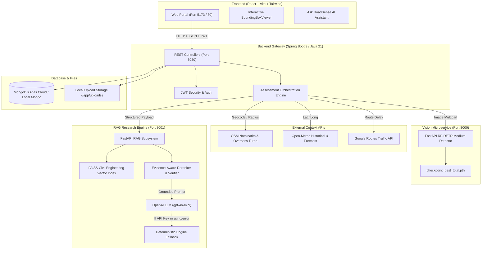

# RoadSense AI — Full-Stack Master Implementation & OpenAI LLM Integration Walkthrough

## Executive Summary

The complete, research-grade **RoadSense AI** system at `D:\projects\Roadsense` has been enhanced with **OpenAI LLM (`gpt-4o-mini`)** as the primary generation engine within the Evidence-Aware Adaptive RAG subsystem, featuring automatic deterministic engineering fallback.

RoadSense AI seamlessly combines state-of-the-art vision models (**RF-DETR Medium**), multi-source real-world environmental context (**OSM Nominatim/Overpass**, **Open-Meteo Weather**, **Google Routes Traffic**), and a civil-engineering grounded **Evidence-Aware Adaptive RAG Subsystem** powered by OpenAI into a unified, production-ready full-stack platform.

---

## Complete System Architecture



---

## Verification & Key Highlights

### 1. Primary Generation Model: OpenAI LLM (`gpt-4o-mini`)
- **Location**: `rag/generation/llm_interface.py`
- **Environment Variables**:
  - `OPENAI_API_KEY`: Read from environment at runtime.
  - `OPENAI_MODEL`: Default `gpt-4o-mini`.
- **Server-Side Security**: API key is **ONLY** processed server-side inside the RAG service. It is **NEVER** exposed to frontend/browser clients or returned in API responses.
- **Strict Grounding Rules**: System prompt enforces 16 civil engineering grounding rules prohibiting hallucinated standards, fabricated numerical rates, or correlation-to-causation overclaims.

### 2. Automatic Fallback Mechanism
- If `OPENAI_API_KEY` is missing, invalid, or an API call fails (network timeout, rate limit, quota exceeded):
  - The system logs a safe operational warning (with API keys sanitized/redacted).
  - Automatically falls back to the existing `deterministic_engineering_engine`.
  - The API service **never crashes**.

### 3. API Config Endpoint (`GET /api/v1/config`)
- Exposes safe system configuration:
  ```json
  {
    "vector_store": "FAISS (roadsense_knowledge)",
    "embedding_model": "all-MiniLM-L6-v2",
    "llm_enabled": true,
    "llm_provider": "openai",
    "model": "gpt-4o-mini",
    "available_modes": ["NO_RAG", "STANDARD_RAG", "EVIDENCE_AWARE_RAG", "EVIDENCE_AWARE_ADAPTIVE_RAG"]
  }
  ```

### 4. RF-DETR Detection Service (`apps/detection-service`)
- **Model Checkpoint**: `models/checkpoint_best_total.pth`
- **Class Mapping**: `0: longitudinal_crack`, `1: transverse_crack`, `2: alligator_crack`, `4: pothole`.
- **Threshold**: `0.30`.

### 5. Evidence-Aware Adaptive RAG Subsystem (`rag`)
- **Official RAG Subsystems Evaluated**:
  1. `STANDARD_RAG`
  2. `EVIDENCE_AWARE_RAG`
  3. `EVIDENCE_AWARE_ADAPTIVE_RAG`
- **Benchmark Alignment**: `NO_RAG` completely excluded from official research benchmark comparisons.

### 6. Security & Secrets Management
- `.gitignore` configured to ignore `.env`, `.env.local`, secret keys, build artifacts.
- `.env.example` created as a template for secure local configuration.
- `docker-compose.yml` updated with runtime environment variable expansion (`OPENAI_API_KEY=${OPENAI_API_KEY:-}`).

---

## Instructions for Running the System

### Setting Runtime Environment Variables
Create a local `.env` file (ignored by Git) or export environment variables:
```bash
export OPENAI_API_KEY="sk-proj-..."
export OPENAI_MODEL="gpt-4o-mini"
```

### Option A: Running via Docker Compose
```bash
cd D:\projects\Roadsense
docker-compose up --build
```
Access the web portal at `http://localhost:5173` or `http://localhost:80`.

### Option B: Running Locally

1. **RF-DETR Service**:
   ```bash
   cd D:\projects\Roadsense\apps\detection-service
   uvicorn app.main:app --port 8000
   ```

2. **RAG Service**:
   ```bash
   cd D:\projects\Roadsense\rag
   uvicorn api.app:app --port 8001
   ```

3. **Backend Gateway**:
   ```bash
   cd D:\projects\Roadsense\apps\backend
   mvn spring-boot:run
   ```

4. **Frontend Portal**:
   ```bash
   cd D:\projects\Roadsense\apps\frontend
   npm run dev
   ```
